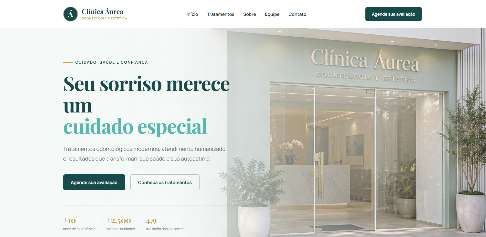

# Clínica Áurea

Landing page de uma clínica odontológica, desenvolvida para portfólio com HTML, CSS e JavaScript. O projeto combina uma identidade visual em verde-água, dourado e branco com fotografias, animações suaves e navegação adaptada a computadores e celulares.

[**Acesse o site publicado**](https://wenderllan.github.io/clinica-aurea/)



## Sobre o projeto

A proposta é apresentar os tratamentos, a estrutura e os profissionais de uma clínica em uma página clara e acolhedora. A interface conduz o visitante da apresentação inicial até as informações de contato, com interações demonstrativas para agendamento e perfis profissionais.

## Funcionalidades

* Carrossel automático no hero, com identificação dos profissionais e links para a seção Equipe.
* Menu responsivo com navegação entre as seções.
* Cards de tratamentos com fotografias reveladas ao passar o mouse no desktop e sempre visíveis no celular.
* Apresentação da clínica, equipe e especialidades.
* Perguntas frequentes com respostas expansíveis.
* Janelas demonstrativas de agendamento e perfis profissionais.
* Animações de entrada durante a rolagem e transições nos elementos interativos.
* Tratamento da preferência por movimento reduzido, indicadores de foco e recursos de navegação por teclado.

## Tecnologias

* **HTML5:** estrutura e conteúdo.
* **CSS3:** layout responsivo com Grid e Flexbox, cores, transições e animações.
* **JavaScript:** carrossel, menu mobile, janelas de demonstração e efeitos de rolagem.
* **Google Fonts:** Manrope e Playfair Display.
* **Git e GitHub:** controle de versão.
* **GitHub Pages:** hospedagem.

## Executar localmente

1. Clone o repositório:

```bash
   git clone https://github.com/Wenderllan/clinica-aurea.git
   ```

2. Abra a pasta `clinica-aurea` no VS Code.
3. Com a extensão Live Server instalada e habilitada, abra `index.html` usando **Open with Live Server**.

O projeto não exige instalação de pacotes nem etapa de compilação.

## Organização dos arquivos

|Caminho|Conteúdo|
|-|-|
|`index.html`|Estrutura da página e janelas de demonstração|
|`css/style.css`|Estilos, responsividade e animações|
|`js/script.js`|Interações da interface|
|`assets/images/`|Imagens da clínica, equipe e tratamentos|
|`assets/favicon.svg`|Ícone da página|

## Projeto demonstrativo

A clínica, os profissionais, os perfis sociais e os indicadores apresentados são fictícios. As imagens foram geradas por inteligência artificial. Os botões de contato e perfis abrem demonstrações: não realizam agendamentos nem acessam contas reais dos profissionais.

## Autor

Desenvolvido por [**Wenderllan**](https://github.com/Wenderllan).

